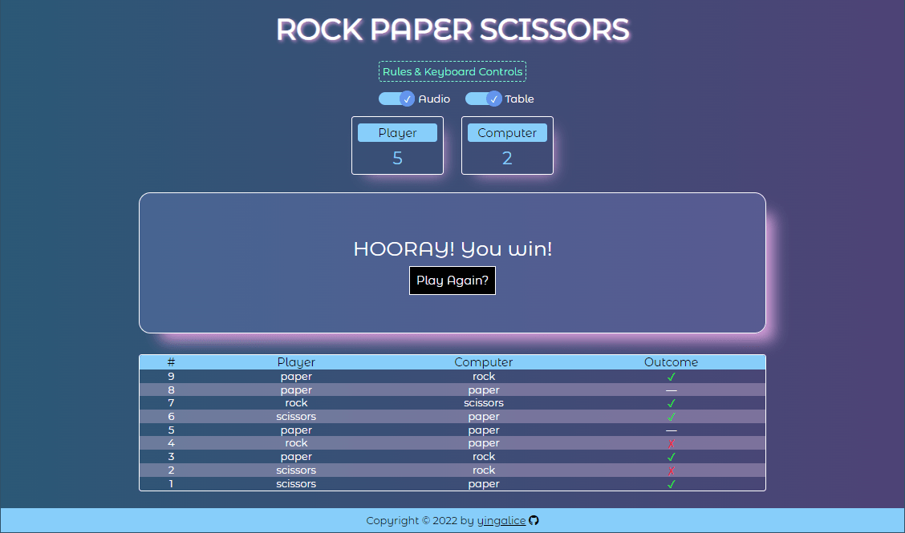

# rock-paper-scissors
## Live Site
- https://yingalice.github.io/rock-paper-scissors

## Description
- Play rock paper scissors against the computer
- Implemented keyboard controls, audio, animations and more
- Created for this JavaScript project ([Part 1](https://www.theodinproject.com/lessons/foundations-rock-paper-scissors) and [Part 2](https://www.theodinproject.com/lessons/foundations-revisiting-rock-paper-scissors)) in The Odin Project curriculum

## Goals
- Get familiar with DOM manipulation (ie. add/remove elements, classes, styles) and event listeners (ie. respond to button clicks)

## What I learned
- Animations
  - Restart animations by triggering reflow with .offsetHeight (removing and re-adding class is not enough)
- Keyboard controls
  - Prevent spamming and playing multiple rounds in one go, by ignoring subsequent keypresses until a flag is cleared
- Audio
  - Restart already playing audio by setting .currentTime to 0
- Toggles
  - Toggles are checkboxes styled with CSS ::before and ::after
- Table
  - Use HTMLTableElement API to dynamically build table
  - Rounded table borders require matching styling on its outer \<th\> and \<td\> corners
- Event listeners
  - Respond to various event types (ie. click, change, mouseover, keydown, animationend, resize)
- :hover
  - Hover is generally applicable to mouse, but not touch (triggers on tap) and keyboard (N/A, simulate by adding a class)
    - Use timeout to add slight delay, so hover styles have time to play upon touch taps and key presses

## Image/Audio Credits
- [See list](./credits.md)

## Screenshots
- Start screen  

- Choose weapon screen  

- Round result screen  

- Game result screen  
